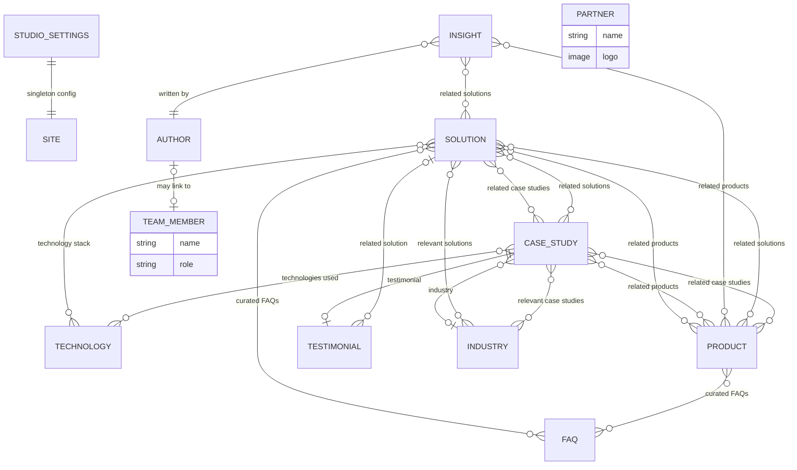

# Nxtedge Studio — CMS Collection Design Review

**Status:** Design proposal only. No schema code written, no repo changes beyond this document.
**Depends on:** `website-audit.md` §10 (CMS/Sanity findings) — treated as verified ground truth here.

> **Amended by Decision 4 in `decisions.md`:** this document's working assumption of *logical* isolation within the existing shared `oladokun.me` dataset has been explicitly rejected. The target is now a fully separate, net-new Sanity project. The 11 collection specs below are still the right design — they now target that new project instead. See `decisions.md` for the current status and the still-open action item of actually creating the new project.

---

## 0. Constraint This Entire Document Sits On Top Of

There is **no Sanity Studio / schema-definition folder anywhere in this repository**. The only evidence of schema shape available to this review is three GROQ queries and their hand-written TypeScript types (`src/lib/sanity/queries.ts`, `src/lib/types/sanity.ts`). The actual `defineType`/`defineField` schema — the real source of truth — is authored somewhere this codebase cannot see.

Additionally, the Sanity **project and dataset are shared with `oladokun.me`**, a separate personal-portfolio site. The existing `project` document type already has to be disambiguated with a `builtAtStudio` boolean because both sites read from the same dataset. Any new document types proposed below will exist in that same shared space and must not collide with whatever `oladokun.me` depends on.

Everything below is therefore a **proposal to react to**, not a spec to implement blind. See §12 for the specific confirmations needed before this becomes real schema code.

---

## 1. Design Principles Behind This Proposal

1. **One `solution` type, not five.** The brief lists five solution areas (Web Development, Mobile Applications, Business Systems, AI Solutions, Cloud & Infrastructure). These are the same shape with different content — modeling them as five separate document types would mean five schemas to maintain and five query variants for what's structurally one content type. A single `solution` type with a `category`/`slug` field scales to a sixth or seventh offering later with zero schema change.
2. **Products must plug in without schema changes.** Nxtflo is the only product today, but the brief is explicit that future products need to slot into the same architecture. `product` is modeled as a standard collection (not a singleton, not a hardcoded Nxtflo-specific type) from day one.
3. **`caseStudy` supersedes `project`**, it doesn't sit beside it. The current `project` type conflates "studio case study" and "personal portfolio item" via the `builtAtStudio` flag. Rather than adding a fourth overlapping concept, this proposal recommends migrating studio-flagged `project` documents into a new, richer `caseStudy` type and leaving `project` to `oladokun.me` alone. Detail in §3.3.
4. **Reference, don't duplicate.** Technology stacks, testimonials, and CTAs are used by multiple collections (Solution, Product, Case Study, Industry). Each gets modeled once and referenced everywhere, not copy-pasted per document type.
5. **`studioService` is retired, not kept.** It's the direct conceptual ancestor of `solution` and would otherwise become a second, competing "what do we offer" list. See §4.

---

## 2. Collection-by-Collection Spec

### 2.1 `solution`

**Purpose:** One of the five core offerings (Web Development, Mobile Applications, Business Systems, AI Solutions, Cloud & Infrastructure) as a first-class, individually routable content type — replaces `studioService`.

| Field | Type | Notes |
|---|---|---|
| `title` | `string` | e.g. "AI Solutions" |
| `slug` | `slug` | source: title |
| `category` | `string` (list) | enum-style: `web-development`, `mobile-applications`, `business-systems`, `ai-solutions`, `cloud-infrastructure` — controls ordering/icon defaults, doesn't replace `slug` |
| `summary` | `text` | short card/listing copy |
| `overview` | Portable Text (`content`) | the "Overview" section on the solution detail page |
| `businessProblems` | array of `text` or small object `{ problem, description }` | "Business problems solved" |
| `capabilities` | array of `{ title, description, icon? }` | "Capabilities" |
| `technologies` | `reference[] -> technology` | "Technology stack" |
| `process` | array of `{ step, title, description }` | ordered — "Process" |
| `relatedCaseStudies` | `reference[] -> caseStudy` | |
| `relatedProducts` | `reference[] -> product` | e.g. AI Solutions → Nxtflo |
| `cta` | object `{ label, url }` or `reference -> ctaPreset` (see §2.9) | |
| `icon` | `image` or `string` (icon key) | listing/nav icon |
| `order` | `number` | controls Solutions overview/nav ordering |
| `seo` | object `{ metaTitle, metaDescription, ogImage }` | reuse the shape already proven in `studioSettings` |

**Relationships:** referenced by `caseStudy`, `industry`, `insight`; references `technology`, `caseStudy`, `product`.

---

### 2.2 `product`

**Purpose:** Nxtflo today, any future Nxtedge product tomorrow, with zero schema change required to add one.

| Field | Type | Notes |
|---|---|---|
| `title` | `string` | e.g. "Nxtflo" |
| `slug` | `slug` | |
| `tagline` | `string` | hero subhead, e.g. "The AI-powered OS for client delivery" |
| `status` | `string` (list) | `live`, `beta`, `coming-soon` — lets "Future Products" render distinctly without a separate document type |
| `heroImage` | `image` | |
| `overview` | Portable Text | |
| `features` | array of `{ title, description, icon? }` | |
| `benefits` | array of `{ title, description }` | distinct from features per the brief — outcome-framed, not capability-framed |
| `screenshots` | array of `image` (with `caption`) | |
| `roadmap` | array of `{ quarterOrLabel, title, description, status }` | status: `planned` / `in-progress` / `shipped` |
| `pricing` | object, **optional, empty for now** — `{ model, tiers: [{ name, price, features[] }] }` | brief says "Pricing (future)"; field exists so it can populate later without a migration |
| `relatedSolutions` | `reference[] -> solution` | e.g. Nxtflo → AI Solutions, Business Systems |
| `relatedCaseStudies` | `reference[] -> caseStudy` | case studies where this product was used internally or by a client |
| `cta` | object `{ label, url }` | e.g. "Request Access" / "Book a Demo" |
| `seo` | object | |

**Relationships:** referenced by `solution`, `caseStudy`; references `solution`, `caseStudy`.

---

### 2.3 `caseStudy` (recommended replacement for `project`)

**Purpose:** Rich, story-driven proof of delivered work — the evolution of today's `project` type into something that actually supports the brief's "Business challenge / Solution / Technologies used / Timeline / Results / Images / Related solutions / Related products / Testimonials" structure, none of which `project` currently has.

**Migration recommendation:** Introduce `caseStudy` as a new type. Do **not** extend `project` in place — `project` is also consumed by `oladokun.me` for non-studio work, and bolting studio-specific fields (business challenge, results, related solutions) onto a type another site depends on is exactly the kind of cross-project schema risk flagged in §0. Instead:
- Existing `project` documents with `builtAtStudio == true` get migrated (one-time script, run against the Studio, out of scope for this repo) into new `caseStudy` documents.
- Once migrated, `Portfolio.svelte`'s query (`studioProjectsQuery`) is repointed at `caseStudy` and the `builtAtStudio` flag can eventually be dropped from `project` entirely once nothing studio-side reads it — cleaning up the exact "shared dataset, disambiguation flag" hack the audit flagged as a smell.

| Field | Type | Notes |
|---|---|---|
| `title` | `string` | project name, e.g. "Quench Point" |
| `slug` | `slug` | |
| `client` | `string` | carried over from `project` |
| `summary` | `text` | listing/card copy — carried over |
| `businessChallenge` | Portable Text | new |
| `solution` | Portable Text | new — narrative of what was built, distinct from `relatedSolutions` (below), which is the taxonomy link |
| `technologies` | `reference[] -> technology` | new — structured, replaces free-text `tags` |
| `timeline` | object `{ startDate, endDate?, durationLabel? }` | new |
| `results` | array of `{ metric, value, description? }` | new — e.g. `{ metric: "Manual tracking time", value: "-80%" }` |
| `coverImage` | `image` | carried over |
| `gallery` | array of `image` | new — "Images" plural per the brief; `coverImage` stays as the listing thumbnail |
| `relatedSolutions` | `reference[] -> solution` | new |
| `relatedProducts` | `reference[] -> product` | new |
| `testimonial` | `reference -> testimonial` | new |
| `liveUrl` | `url` | carried over |
| `order` | `number` | carried over |
| `seo` | object | new |

**Relationships:** referenced by `solution`, `product`, `industry`; references `technology`, `solution`, `product`, `testimonial`.

---

### 2.4 `industry`

**Purpose:** Industry-focused landing pages (Food & Beverage, Finance, Healthcare, Manufacturing, Education, Government, Professional Services).

| Field | Type | Notes |
|---|---|---|
| `title` | `string` | e.g. "Food & Beverage" |
| `slug` | `slug` | |
| `summary` | `text` | |
| `challenges` | array of `{ title, description }` | "Industry challenges" |
| `howWeSolve` | Portable Text | "How Nxtedge solves them" |
| `relatedSolutions` | `reference[] -> solution` | |
| `relatedCaseStudies` | `reference[] -> caseStudy` | e.g. Quench/Quench Point case studies tagged under Food & Beverage |
| `icon` or `heroImage` | `image` | |
| `order` | `number` | |
| `seo` | object | |

**Relationships:** references `solution`, `caseStudy`.

Note: `caseStudy` does **not** need a reciprocal `industry` reference field if industry↔case-study is queried from the industry side only; if the Work/case-study listing page needs to filter or badge by industry, add `industry: reference -> industry` on `caseStudy` too (bidirectional reference, both sides queryable). Recommend adding it — cheap now, expensive to retrofit once case studies exist.

---

### 2.5 `technology`

**Purpose:** Lightweight, reusable tag — "React", "Sanity", "Claude API", "AWS" — referenced by `caseStudy.technologies` and `solution.technologies` instead of each collection maintaining its own free-text tag list.

| Field | Type | Notes |
|---|---|---|
| `name` | `string` | |
| `slug` | `slug` | optional — only needed if technologies get their own filterable listing/page |
| `icon` | `image` or `string` | logo/icon |
| `category` | `string` (list) | `language`, `framework`, `infrastructure`, `ai-ml`, `database`, etc. — for grouping in a "Technology stack" display |

**Relationships:** referenced by `solution`, `caseStudy`. No outgoing references — intentionally a leaf type.

---

### 2.6 `author`

**Purpose:** Byline for Insights content. Kept separate from `teamMember` even though there will be overlap (a team member may also write) — an author is a content-attribution concept, a team member is an About-page concept. They can coexist for the same person via a `linkedTeamMember: reference -> teamMember` optional field rather than merging the two types, since not every author (e.g. a guest contributor) is staff.

| Field | Type | Notes |
|---|---|---|
| `name` | `string` | |
| `slug` | `slug` | for author archive pages, if wanted later |
| `avatar` | `image` | |
| `role` | `string` | e.g. "Founder", "Engineering Lead" |
| `bio` | `text` | short |
| `linkedTeamMember` | `reference -> teamMember`, optional | |

**Relationships:** referenced by `insight`.

---

### 2.7 `insight`

**Purpose:** Content-hub articles across Technology, Engineering, AI, Business, Product Updates, Company News.

| Field | Type | Notes |
|---|---|---|
| `title` | `string` | |
| `slug` | `slug` | |
| `category` | `string` (list) | `technology`, `engineering`, `ai`, `business`, `product-updates`, `company-news` |
| `excerpt` | `text` | |
| `body` | Portable Text | |
| `coverImage` | `image` | |
| `author` | `reference -> author` | |
| `publishedAt` | `datetime` | |
| `relatedSolutions` | `reference[] -> solution`, optional | |
| `relatedProducts` | `reference[] -> product`, optional | e.g. a "Product Updates" post about Nxtflo links back to the Nxtflo product page |
| `seo` | object | |

**Relationships:** references `author`, `solution`, `product`.

---

### 2.8 `testimonial`

**Purpose:** Currently non-existent as a modeled type — `Testimonials.svelte` is 100% hardcoded per the audit (§5, §10). This is the most immediately actionable gap: even before Phases 3+ ship, wiring this one type up fixes a component that's already built and waiting for data.

| Field | Type | Notes |
|---|---|---|
| `quote` | `text` | |
| `authorName` | `string` | |
| `authorRole` | `string` | e.g. "CEO & Founder" |
| `authorCompany` | `string` | |
| `authorAvatar` | `image`, optional | |
| `relatedCaseStudy` | `reference -> caseStudy`, optional | |
| `relatedSolution` | `reference -> solution`, optional | |
| `featured` | `boolean` | for homepage vs. full testimonials listing |

**Relationships:** referenced by `caseStudy` (one-to-one, via `caseStudy.testimonial`); optionally references `solution`.

---

### 2.9 `faq`

**Purpose:** Reusable question/answer content, referenced from Solutions, Products, and Industries pages rather than hardcoded per page.

| Field | Type | Notes |
|---|---|---|
| `question` | `string` | |
| `answer` | Portable Text | |
| `category` | `string` (list), optional | `general`, `solutions`, `products`, `pricing`, `process` — lets a page pull only relevant FAQs |
| `order` | `number` | |

**Relationships:** none outgoing. Referenced *ad hoc* — recommend `solution`, `product`, and `industry` each get an optional `faqs: reference[] -> faq` field so any page can opt in to a curated FAQ set without FAQ content needing to know about its consumers.

*(Note: a `ctaPreset` type was referenced loosely in §2.1 as an alternative to inline CTA objects — not treating this as required for v1. Simple `{ label, url }` objects on each type are sufficient until CTA copy needs to be centrally managed across many pages; flagging it as a "if this becomes annoying to maintain, extract it" item rather than proposing it now, per the brief's instruction to avoid premature abstraction.)*

---

### 2.10 `teamMember`

**Purpose:** About page — Leadership/Culture sections.

| Field | Type | Notes |
|---|---|---|
| `name` | `string` | |
| `role` | `string` | |
| `photo` | `image` | |
| `bio` | `text` | |
| `linkedIn` | `url`, optional | |
| `order` | `number` | |
| `isLeadership` | `boolean` | distinguishes founder/leadership grid from a broader "Culture" team grid, if both are wanted |

**Relationships:** none. Standalone; optionally linked from `author` (§2.6).

---

### 2.11 `partner`

**Purpose:** Logos/names for a "Trusted By" or partnerships section (homepage "Trusted By" per Phase 3's proposed structure, and/or a dedicated partnerships section).

| Field | Type | Notes |
|---|---|---|
| `name` | `string` | |
| `logo` | `image` | |
| `url` | `url`, optional | |
| `type` | `string` (list), optional | `client`, `technology-partner`, `agency-partner` — lets "Trusted By" and a future partnerships page pull different subsets from one type |
| `order` | `number` | |

**Relationships:** none. Standalone.

---

## 3. What Happens to the Existing Types

### 3.1 `studioSettings` — **keep, extend**
Still the right shape for global/singleton site config (contact info, socials, hero/about fallback copy, default SEO). Recommend adding: `heroTagline` (distinct from the existing `heroHeading`, for the new positioning line "We build technology that helps businesses grow"), and a `defaultCta` for site-wide fallback CTAs. No breaking changes needed — this type is additive-only.

### 3.2 `studioService` — **retire**
Directly superseded by `solution` (§2.1). Keeping both would mean two "what do we offer" lists that inevitably drift out of sync — exactly the kind of duplicated-source-of-truth problem the audit already flagged for nav links and fallback copy (audit §5, §16). Recommend: build `solution`, migrate the 3 existing `studioService` documents into it (trivial — the field overlap is title/description/icon/order, a near 1:1 mapping), repoint `Services.svelte`'s query, then delete the `studioService` type from schema once nothing references it.

### 3.3 `project` — **narrow back to its original scope, stop overloading it**
Per §2.3: `caseStudy` takes over the studio-facing job `project` was being stretched to do via `builtAtStudio`. `project` reverts to being purely `oladokun.me`'s type. This is a cleanup that benefits both sites, not just this one — it removes cross-site coupling from a type that shouldn't have had it.

---

## 4. Relationship Diagram

`teamMember` and `partner` are intentionally leaf nodes with no outgoing/incoming content references (About-page and Trusted-By display only) — omitted from most of the relational web above by design, not by omission.

---

## 5. Summary Table — All Proposed Collections

| Type | New or existing | Referenced by | References |
|---|---|---|---|
| `studioSettings` | existing, extend | — | — |
| `solution` | **new** (replaces `studioService`) | `caseStudy`, `industry`, `insight` | `technology`, `caseStudy`, `product`, `faq` |
| `product` | **new** | `solution`, `caseStudy`, `insight` | `solution`, `caseStudy`, `faq` |
| `caseStudy` | **new** (replaces studio-flagged `project`) | `solution`, `product`, `industry` | `technology`, `solution`, `product`, `testimonial`, `industry` |
| `industry` | **new** | `caseStudy` | `solution`, `caseStudy` |
| `technology` | **new** | `solution`, `caseStudy` | — |
| `author` | **new** | `insight` | `teamMember` (optional) |
| `insight` | **new** | — | `author`, `solution`, `product` |
| `testimonial` | **new** | `caseStudy` | `solution` (optional) |
| `faq` | **new** | `solution`, `product`, `industry` | — |
| `teamMember` | **new** | `author` (optional) | — |
| `partner` | **new** | — | — |
| `project` | existing, **scope narrowed** | (`oladokun.me` only, going forward) | — |
| `studioService` | existing, **retire** | — | — |

---

## 6. This Is a Proposal, Not an Implementation

Nothing above is built. Before any of this becomes real Sanity schema:

1. **Where does schema actually get authored?** This repo has no Studio config. If there's a separate Studio repo, it needs to be inspected before implementation starts — field names, validation rules, and existing content structure there may differ from what's inferred here from three GROQ queries.
2. **Shared-dataset coordination.** Every new document type proposed here lands in the same Sanity project/dataset as `oladokun.me`. Adding 11 new document types to a shared dataset is a meaningful schema change for a project this repo doesn't own outright — confirm who else needs to sign off, and confirm the `project` → `caseStudy` migration (§2.3, §3.3) won't break anything `oladokun.me` currently depends on.
3. **Migration execution.** The `studioService → solution` and `project → caseStudy` migrations (§3.2, §3.3) both involve moving live content between types. That's a scripted, one-time Studio-side operation, not something this repo's GROQ queries can do — needs to be planned as its own step with a rollback plan, not bundled silently into a routing/component PR.
4. **Sequencing against Phase 1.** This document defines *what* the CMS should model; it doesn't yet map each new route in the proposed sitemap to which queries it needs. That mapping is a natural next step once this collection design is approved, but is out of scope for this document.

Awaiting review before any schema, query, or migration work begins.
